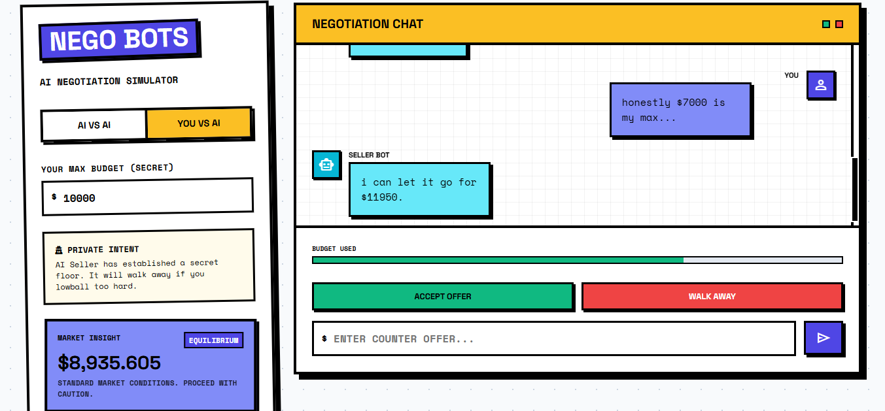
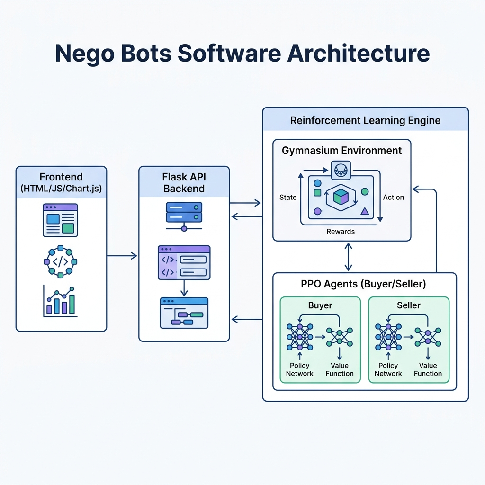
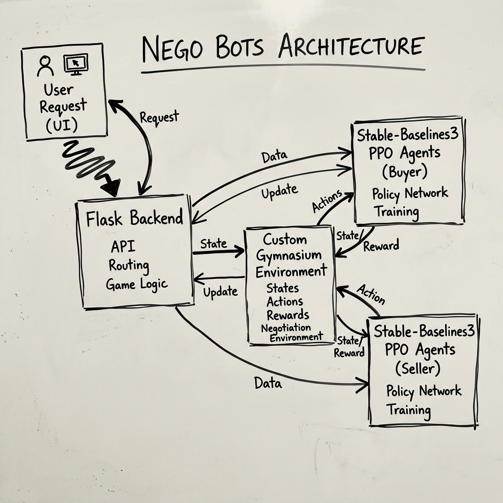

<div align="center">

# 🤖🤝 NEGO BOTS 

**An AI-driven Negotiation Simulator bridging Human Psychology with Reinforcement Learning.**

[](https://python.org)
[](https://flask.palletsprojects.com)
[](https://pytorch.org/)
[](https://opensource.org/licenses/MIT)

**Nego Bots is an interactive web-based simulator where you can watch AI models battle over pricing, or step into the arena yourself and test your haggling skills against a mathematically ruthless AI Seller.**

[Explore the Code](#architecture) • [Setup Guide](#quick-install) • [Features](#features-breakdown)

</div>

---


---

## What Can You Do?

**From the Player's perspective:**
- **Human vs AI:** Negotiate against a fully autonomous AI seller that adapts to your offers.
- **AI vs AI:** Watch two distinct Reinforcement Learning agents clash in a rapid-fire bargaining session.
- **Dynamic Feedback:** See live market appraisals and a real-time pressure gauge indicating how much of your budget is left.

**From the Developer's perspective:**
- **Train Custom Agents:** Modify `training/train.py` to bake unique personalities (Aggressive, Cooperative) into the RL agents.
- **Custom Gym Environment:** The logic runs on a bespoke Gymnasium environment designed specifically for multi-turn negotiation mechanics.
- **Analyze Performance:** View live Chart.js graphs mapping out the concession curves of both parties.

---

## Features Breakdown

| Feature | What it does |
|---------|--------------|
| **Neobrutalist UI** | A stunning, high-contrast, interactive interface designed for maximum engagement. |
| **RL Backend (PPO)** | Proximal Policy Optimization powers the agents' decision-making and dynamic pricing strategy. |
| **Live Chat Simulation** | Realistic typing indicators and speech-bubble chat interfaces. |
| **Hidden Constraints** | Buyers have secret budgets, Sellers have secret floors. AI learns to deduce these limits over time. |
| **Concession Analytics** | Generates real-time visual charts to track bargaining history. |

---

<div align="center">
  
</div>

---

## Architecture

Three powerful layers work seamlessly together:

<div align="center">
  
  <br><br>
  
</div>
<br>

| Component | Function | Built with |
|-----------|---------------|------------|
| **Frontend** | Renders the interactive UI, chat logs, and live concession charts. | HTML5, CSS (Neobrutalism), Vanilla JS, Chart.js |
| **Backend API** | Bridges the frontend to the RL logic, handling state and session persistence. | Python, Flask |
| **RL Environment** | Custom multi-turn bargaining environment defining rewards and action spaces. | Gymnasium, Stable-Baselines3, PyTorch |

---

## Quick Install

Get the simulator running locally in seconds.

```powershell
# 1. Clone the repository
git clone https://github.com/MuhammadTahaNasir/Terry.git
cd Terry

# 2. Create and activate a virtual environment
python -m venv venv
venv\Scripts\activate  # Windows
# source venv/bin/activate  # macOS/Linux

# 3. Install the engine dependencies
# (Includes gymnasium, stable-baselines3, torch, flask, pandas)
pip install gymnasium stable-baselines3 torch flask numpy matplotlib seaborn pandas

# 4. Boot the server
python app/app.py
```

After starting the server, open **`http://127.0.0.1:5000`** in your browser.

---

## Project Structure

```text
Terry/
├── app/                  # Frontend presentation layer
│   ├── app.py            # Flask server and routing API
│   └── templates/        # Neobrutalist UI templates
├── env/                  # Core RL mechanics
│   └── negotiation_env.py# Custom Gymnasium multi-turn bargaining env
├── models/               # The AI Brains
│   ├── trained_buyer.zip # PPO-trained Buyer agent
│   └── trained_seller.zip# PPO-trained Seller agent
├── training/             # RL Training pipeline
│   └── train.py          # Scripts to retrain and tweak the models
└── screenshots/            # Screenshots and assets
```

---

## Roadmap / Future Goals ⚠️

Development is ongoing! Here is what's next:
- **LLM Integration:** Moving away from numerical inputs to true natural language parsing (e.g., *"I'll give you $90 right now in cash"*).
- **Auction Mode:** Multi-party bidding where 2+ AI agents compete for a single Seller's item.
- **Leaderboards:** Global scoring system ranking human negotiators against the Hard AI.

---

## License & Contributing

This project is open-source under the **MIT License**.

Want to contribute? 
1. Fork the repository.
2. Implement your feature (e.g., a new AI personality).
3. Submit a Pull Request.

*Designed and Developed by Muhammad Taha Nasir.*
