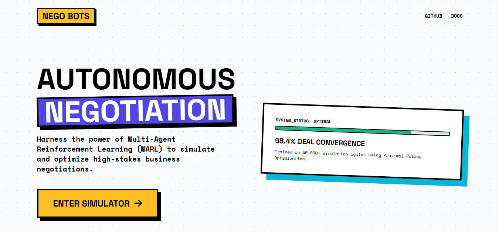

# NEGO BOTS - AI Negotiation Simulator 🤖🤝

[](https://python.org)
[](https://flask.palletsprojects.com)
[](https://stable-baselines3.readthedocs.io/)
[](https://opensource.org/licenses/MIT)

> 🌐 **Repository:** [https://github.com/MuhammadTahaNasir/Terry](https://github.com/MuhammadTahaNasir/Terry)

A cutting-edge web application that simulates real-world negotiations using Reinforcement Learning. Built with Flask and Stable-Baselines3, this project demonstrates how AI agents can learn complex bargaining strategies, handle hidden constraints, and make dynamic concessions. 

---

## 🌟 Features

- **Two Simulation Modes**: 
  - 🤖 **AI vs AI:** Watch two distinct RL models (Buyer and Seller) negotiate autonomously.
  - 👤 **Human vs AI:** Step into the shoes of the Buyer and test your haggling skills against a trained AI Seller.
- **Advanced RL Backend**: Powered by Proximal Policy Optimization (PPO) and a custom Gymnasium environment.
- **Dynamic Market Intelligence**: Live market sentiment appraisals that simulate real-world economic pressures.
- **Neobrutalist UI**: A stunning, modern, and highly interactive frontend interface.
- **Live Analytics**: Real-time tracking of concession curves and deal prices using Chart.js.

---

## 📸 Previews

### Simulator Interface


### Live Concession Analytics


---

## 📂 Project Structure

```
negotiation_project/
├── app/
│   ├── app.py                  # Main Flask application entry point
│   └── templates/
│       ├── index.html          # Interactive Simulator UI
│       └── landing.html        # Welcome/Landing Page
├── env/
│   └── negotiation_env.py      # Custom Gymnasium environment for RL
├── models/
│   ├── trained_buyer.zip       # Pre-trained PPO Buyer Agent
│   └── trained_seller.zip      # Pre-trained PPO Seller Agent
├── training/
│   └── train.py                # Scripts for training the RL models
├── analysis/                   # Analytics and evaluation scripts
├── graphs/                     # Output visualizations of model performance
└── README.md
```

---

## 🚀 Installation & Setup

1. **Clone the repository**:
   ```bash
   git clone https://github.com/MuhammadTahaNasir/Terry.git
   cd Terry
   ```

2. **Create a virtual environment**:
   ```bash
   python -m venv venv
   # On Windows:
   venv\Scripts\activate
   # On Mac/Linux:
   source venv/bin/activate
   ```

3. **Install dependencies**:
   *(Ensure you have the required ML libraries installed)*
   ```bash
   pip install gymnasium stable-baselines3 torch flask numpy matplotlib seaborn pandas
   ```

4. **Run the application**:
   ```bash
   python app/app.py
   ```

5. **Access the application**:
   Open your browser and navigate to `http://127.0.0.1:5000`

---

## 🧠 Architecture

### 1. The Environment Layer (`env/`)
A custom **Gymnasium** environment that defines the rules of negotiation. It handles action spaces (proposing prices, accepting, walking away), tracks the hidden floor/budget constraints, and calculates rewards based on successful deals and saved margins.

### 2. The RL Logic Layer (`models/` & `training/`)
Utilizes **Stable-Baselines3 (PPO)** to train agents over thousands of episodes. The AI learns when to hold firm, when to make a concession, and how to maximize its surplus without triggering a walk-away from the opponent.

### 3. The Presentation Layer (`app/`)
A **Flask** backend that bridges the Python RL models with a sleek HTML/CSS/JS frontend. It handles state persistence during Human vs AI sessions and streams chat logs and analytics directly to the UI.

---

## 🔮 Future Enhancements
- **LLM Integration:** Parse natural language inputs so humans can type real sentences instead of numbers.
- **Personality Profiles:** Distinct AI models trained to be Aggressive, Cooperative, or Unpredictable.
- **Multi-Party Bidding:** Expanding the environment to support auction-style negotiations with multiple AI buyers.

---

## 📜 License
This project is open-source and available under the MIT License.
